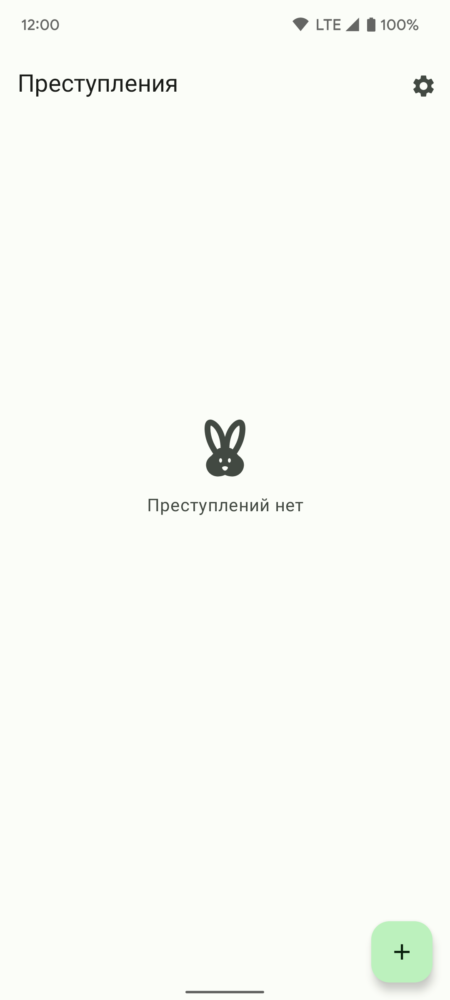

# Wretches

Wretches (с англ. "негодяи") - приложение с записями об офисных преступлениях.
Здесь можно анонимно нажаловаться на своих коллег, которые очень плохо себя ведут и
разводят беспорядок.

Приложение было написано для демонстрации работы с файловым хранилищем в Android.
Здесь используются всевозможные способы хранения данных на устройстве, а именно:
- Работа с базами данных (Room)
- Работа с Shared Preferences через Jetpack DataStore
- Работа с внутренним хранилищем приложения
- Работа с пермишнами и Scoped Storage
- Работа с Storage Access Framework

## Дополнительно

В приложении дополнительно представлена работа с:
- Window Insets для поддержки концепции edge-to-edge;
- Компонентами из библиотеки Material 3 для поддержки концепции Material You;
- Поддержка светлой и тёмной темы.

## Скриншоты

### Главный экран в разных цветах Material You

  

### Экран с отсутствием преступлений

### Создание/редактирование преступления

 

### Тема приложения

 
